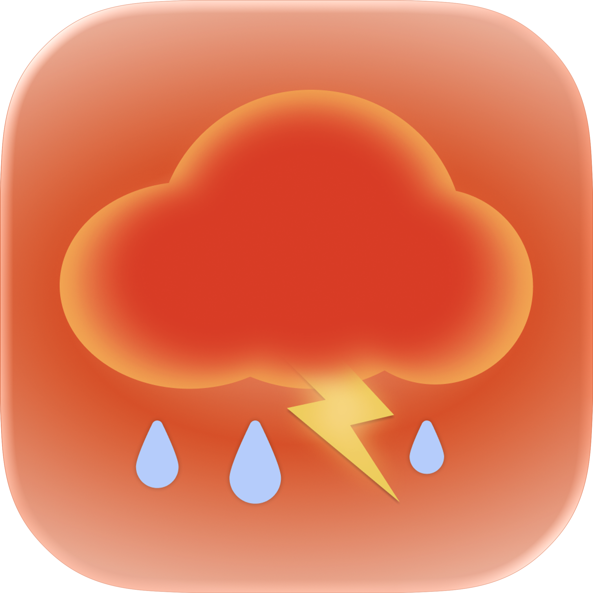
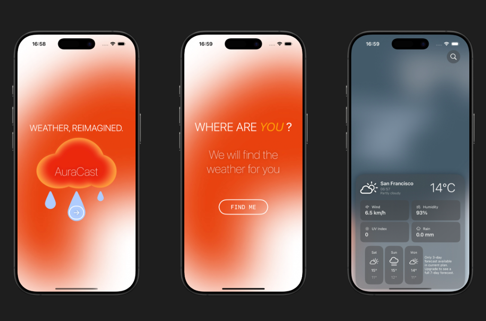
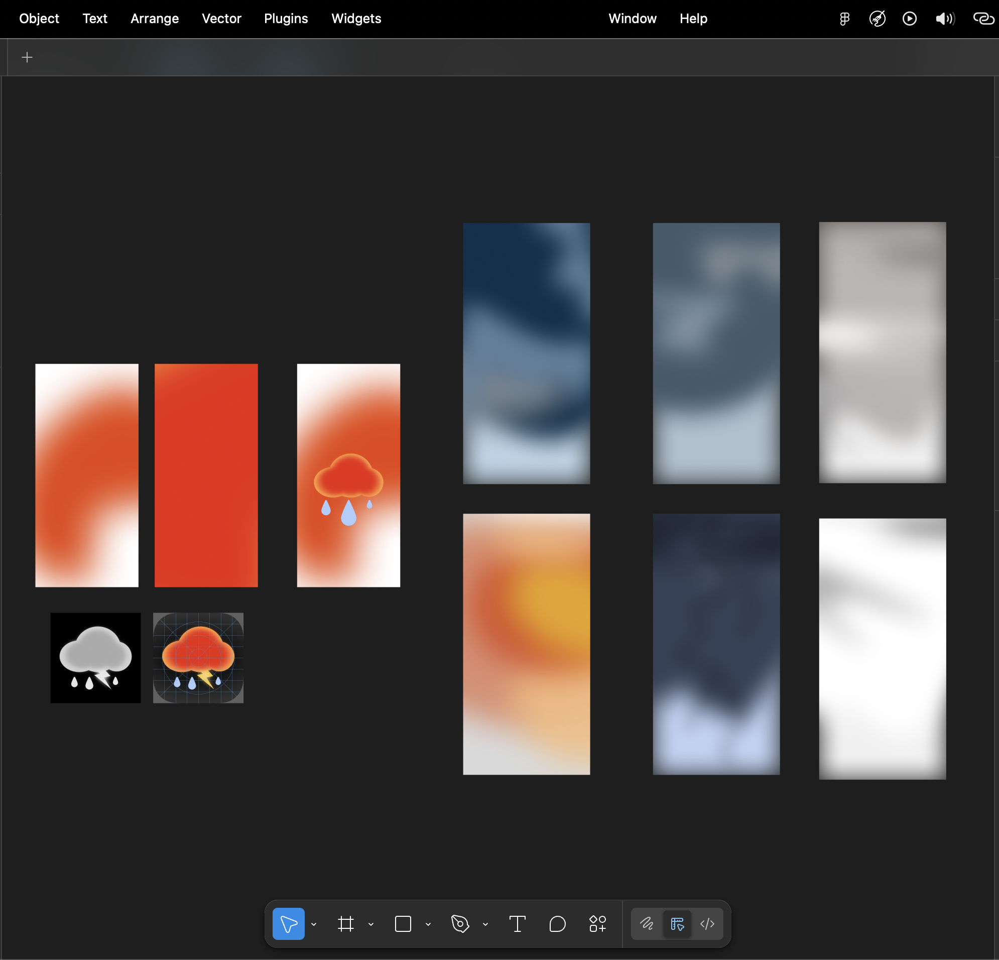

<h1>
  
  AuraCast – Minimal Weather App
</h1>

---

AuraCast is a minimalistic weather application built with Swift and SwiftUI.  
The goal of this project was to remove unnecessary complexity found in most modern weather apps and focus only on essential, readable information.

This app was designed and developed as a personal product and portfolio showcase.

---

## Preview

---

## Features

- Clean, minimal user interface  
- Real-time weather based on user location  
- 7-day forecast  
- City search with live suggestions  
- Smooth loading states and state persistence  

---

## Technical Details

- Built with **Swift & SwiftUI**
- Location services via **CoreLocation**
- Weather data fetched from **WeatherAPI**
- Async/await networking
- State persistence using `@AppStorage`
- Custom UI designed entirely in Figma (icons, gradients, layout)

---

## Assets 
